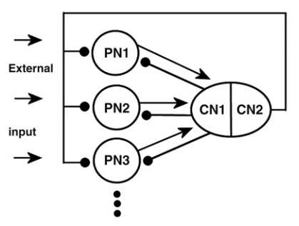
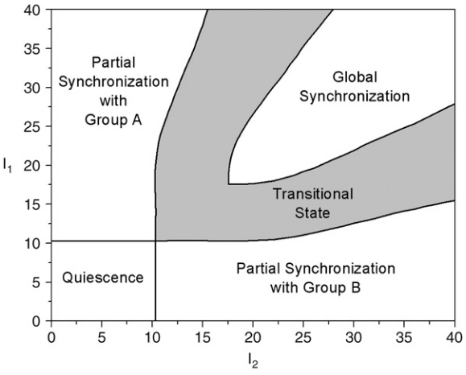

# Papers summary


## Selective attention model with spiking elements 
### Introduction
1. Visual attention in human and monkey brains is realized by a large-scale distributed neural network that includes several cortical and subcortical areas with bottom-up and top-down flow of information between them.
2. **Despite intensive studies of neuronal activity related to attetnion, it is still unclear what neuronal mechanisms are used by the brain to implement attention.**
3. Two types of attentional modulation has been proposed:
	+ Increased excitation of neurons representing attended stimuli is observed while neural activity evoked by unattended stimuli is reduced to a low level.
	+ Gamma range oscillations correlate with the activity of neurons in the attentional focus.

*The model proposed by the authors, using hodgkin-Huxley neurons, aims to elucidate how selective attention can be represented by the synchrony and suppresion of neural activity in a network of interactive spiking elements*


### Results
1. The model exhibits five global dynamical states: Partial synchronization A; Transition state; Global synchronization; Partial synchronization B; Quiescence.  
	1. Partial synchronization is interpreted as selective attention, where population A or B is "attending" to some stimuli.
	2. Transition state is interpreted as different degrees of attention concentration (could be attentional shift?)
2. **There remain many uncertainties abouth the complete bifurcation structure of the model, therefore further investigations are required**
3. In the simulations, selective attention (associated with partial synchronization) always favours a group with higher frequency


```{r echo=FALSE, fig.show = "hold", fig.cap="Model(left) and bifurcation space(right)", out.width = "50%", fig.align ="default"}


```

